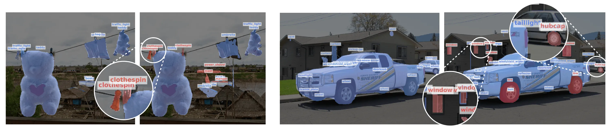

# Learning to Discover and Detect Objects



This repository provides the official implementation of the following paper:

**Learning to Discover and Detect Objects**

[Vladimir Fomenko](https://github.com/vlfom/),
[Ismail Elezi](https://dvl.in.tum.de/team/elezi/),
[Deva Ramanan](https://www.cs.cmu.edu/~deva/),
[Aljoša Ošep](https://dvl.in.tum.de/team/osep/),
[Laura Leal-Taixé](https://dvl.in.tum.de/team/lealtaixe/)

In Advances in Neural Information Processing Systems 34 (NeurIPS 2022).

[Project page](https://vlfom.github.io/rncdl/) | [Paper](#) | [Source code](https://github.com/vlfom/rncdl) | [Poster](#) | [Presentation](#)

> **Abstract**: We tackle the problem of novel class discovery, detection, and localization (NCDL). In this setting, we assume a source dataset with labels for objects of commonly observed classes. Instances of other classes need to be discovered, classified, and localized automatically based on visual similarity, without human supervision. To this end, we propose a two-stage object detection network RNCDL, that uses a region proposal network to localize potential objects and classify them. We train our network to classify each proposal, either as one of the known classes, seen in the source dataset, or one of the extended set of novel classes with a constraint that the distribution of class assignments should follow natural long-tail distributions common in the real open-world. By training our detection network with this objective in an end-to-end manner, it learns to classify all region proposals for a large variety of classes, including those that are not part of the labeled object class vocabulary.

# Installation

Our implementation is based on the [Detectron2](https://github.com/facebookresearch/detectron2) framework. Please follow [Detectron2's setup guide](https://github.com/facebookresearch/detectron2/blob/main/INSTALL.md) and pick the **CUDA=11.3** and **torch=1.10** versions (`python -m pip install detectron2 -f https://dl.fbaipublicfiles.com/detectron2/wheels/cu113/torch1.10/index.html` may work). We do not require any additional dependencies, apart from the default ones used by Detectron2.

## Download datasets

For COCO + LVIS experiments, download COCO and LVIS datasets as instructed in the [Detectron2 data documentation](https://detectron2.readthedocs.io/en/latest/tutorials/builtin_datasets.html).

**Note on LVIS + VisualGenome experiments:** LVIS and VisualGenome datasets largely overlap (50K images). VisualGenome does not provide a default train-val split and for our setup we devised a specific split so that the validation images are those that appear in LVIS validation split and can be found in VisualGenome. For more details, please see our paper (supplementary).

For LVIS + VisualGenome experiments, first download LVIS dataset as instructed above. For VisualGenome dataset we had to pre-process it to match the Detectron2 format and thus it's required to download our custom annotation files in addition to the images provided in the original dataset. First, download the VisualGenome images v1.2 from the [official website](https://visualgenome.org/api/v0/api_home.html). Then, put them **in the same folder where LVIS images are located**. Then, download our prepared annotations from [this link](#). Put them to the `$DETECTRON2_DATASETS$/visualgenome/` folder (if you want to use a different folder, please modify `configs/data/register_vglvis.py` file accordingly).

## Download checkpoints

We start our R-CNN training from a backbone pretrained in a self-supervised manner, specifically, MoCo v2. For that, please download 800-epoch weights from MoCo official repository or using [this link](https://dl.fbaipublicfiles.com/moco/moco_checkpoints/moco_v2_800ep/moco_v2_800ep_pretrain.pth.tar) (obtained from [this table](https://github.com/facebookresearch/moco#models)), clone the [official moco repository](https://github.com/facebookresearch/moco), and [run a script as described here](https://github.com/facebookresearch/moco/tree/main/detection) to convert the weights to the Detectron2 format.

# Running experiments

We use [Detectron2's lazy configuration](https://detectron2.readthedocs.io/en/latest/tutorials/lazyconfigs.html) to define our framework. The configurations are located in `configs/` folder and the root config files can be found in `config/train/`.

For convenience, we provide [slurm](https://slurm.schedmd.com/documentation.html) example job scripts that are based on the scripts that we used to execute the jobs. They can be found in `slurm_scripts/`.
All our experiments were tested on 4 NVIDIA A40 GPUs with 48G memory.

To train our fully-supervised baselines, please use scripts in the `slurm_scripts/fully_supervised/` folder. E.g. to train a fully-supervised R-CNN on COCO<sub>half</sub> use:

```
python tools/train_supervised.py \
    \
    --config-file ./configs/train/fully_supervised/coco50pct.py \
    --num-gpus 4 \
    --dist-url 'tcp://localhost:10042' \
    \
    train.init_checkpoint=./checkpoints/moco_v2_800ep_pretrain.pkl \
    train.output_dir=./output \
    train.exp_name="coco50pct-fully_super" \
    train.eval_period=20000
```

To train our discovery networks, please use scripts in the `slurm_scripts/discovery/` folder. E.g. to run discovery training for COCO<sub>half</sub> + LVIS setup use:

```
python tools/train_discovery.py \
    \
    --config-file ./configs/train/discovery/coco50pct_lvis.py \
    --num-gpus 4 \
    --dist-url 'tcp://localhost:10042' \
    \
    train.exp_name="coco50pct_lvis-discovery" \
    train.output_dir=./output \
    train.eval_period=999999 \
    discovery_evaluator.evaluator.output_dir=./output \
    \
    train.init_checkpoint=./checkpoints/coco50pct_pretrain.pkl \
    train.max_iter=15000 \
    optimizer.lr=0.01 \
    train.seed=42 \
    \
    model_proposals_extraction_param.test_nms_thresh=1.01 \
    model_proposals_extraction_param.test_topk_per_image=50 \
    \
    train.supervised_loss_lambda=0.5 \
    \
    model_supervised.roi_heads.box_predictor.discovery_model.num_unlabeled=3000 \
    model_supervised.roi_heads.box_predictor.discovery_model.sk_mode="lognormal" \
    \
    model_supervised.roi_heads.box_predictor.discovery_model.memory_batches=100 \
    model_supervised.roi_heads.box_predictor.discovery_model.memory_patience=150

```

# Citation
If you find RNCDL useful in your research or reference it in your work, please star our repository and use the folowing:
```
@inproceedings{fomenko2022learning,
    author = {Volodymyr Fomenko and Ismail Elezi and Deva Ramanan and Aljo\v{s}a O\v{s}ep and Laura Leal-Taix{'e}},
    title = {Learning to Discover and Detect Objects},
    booktitle={Advances in Neural Information Processing Systems},
    year = {2022}
}
```
